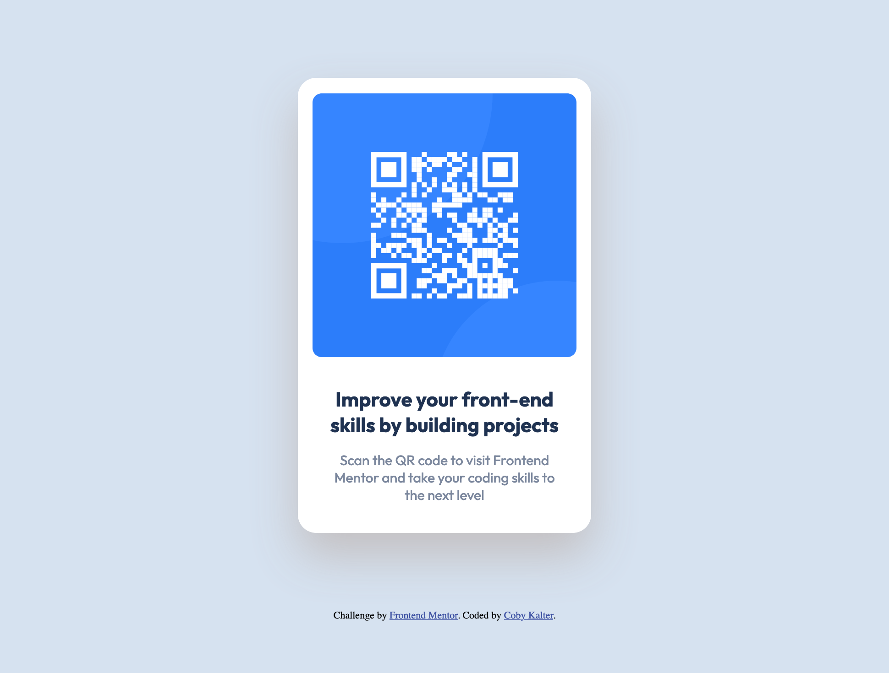

# Frontend Mentor - QR code component solution

This is a solution to the [QR code component challenge on Frontend Mentor](https://www.frontendmentor.io/challenges/qr-code-component-iux_sIO_H). Frontend Mentor challenges help you improve your coding skills by building realistic projects. 

## Table of contents

- [Overview](#overview)
  - [Screenshot](#screenshot)
  - [Links](#links)
- [My process](#my-process)
  - [Built with](#built-with)
  - [What I learned](#what-i-learned)
  - [Continued development](#continued-development)
  - [Useful resources](#useful-resources)
- [Author](#author)


## Overview

This project features a one page site with a card and a QR Code where users can learn more about Frontend Mentor. The site is responsive to different screensizes using CSS media queries.

### Screenshot




### Links

- Solution URL: [Solution URL](https://github.com/CobyKalter/qr-code-component-main)
- Live Site URL: [Live Site URL](https://cobykalter.github.io/qr-code-component-main/)

## My process

Utilizing the Figma design file, I was able to create the mobile first version of the QR Code and then provide stylings for Tablets and Desktops. First I utilized the html template provided and started by adding the Google Font Stylings, then the CSS stylesheet, and finally added in additional div elements and classes as necessary to style each element. Using the design file in figma I was able to figure out the measurements for margin, padding, height and width. I also the color palette, font-sizing, and font family provided in the style guide. 

### Built with

- HTML5
- CSS Flexbox
- Mobile-first workflow
- CSS Media Queries


### What I learned

Through this project I learned more about the CSS drop-shadow, which I applied to the card. I was familiar with the box-shadow, which has similar effects but drop-shadow is more versatile in use with various elements. The design file did not have the correct color shading for the drop shadow, so I had to customize it using HEX code. This was the best option becuase I could not apply opacity to the div with the drop-shadow without affecting all the content within the card div.

```css
.card {
  filter: drop-shadow(#c0bbbbe4 0 25px 25px);
}
```

### Continued development

To further my learning with this project, I would want to consider different ways to split of the divs so that I could use the opacity feature of CSS.

### Useful resources

- [MDN: CSS Drop-Shadow](https://developer.mozilla.org/en-US/docs/Web/CSS/filter-function/drop-shadow) - This helped me for applying the drop-shadow to the card div. 
- [MDN: CSS Opacity](https://developer.mozilla.org/en-US/docs/Web/CSS/filter-function/opacity) - This helped me to understand the opacity feature function in CSS. Ultimately, hekping me realize I could not apply it without changing my html elements

## Author

- Website - [Coby Kalter](https://cobykalter.com)
- Frontend Mentor - [@CobyKalter](hhttps://www.frontendmentor.io/profile/CobyKalter)


